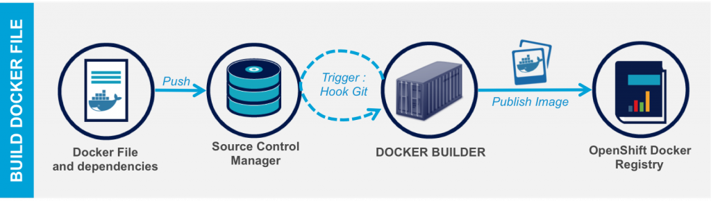

# Alerant - BME PaaS labor
# OpenShift áttekintés
## OpenShift Origin vs OpenShift Enterprise

## Alapfogalmak
## OpenShift Architektúra

## Alkalmazásfejlesztés

## OpenShift skálázási lehetőségek

## OpenShift hálózati kommunikáció

