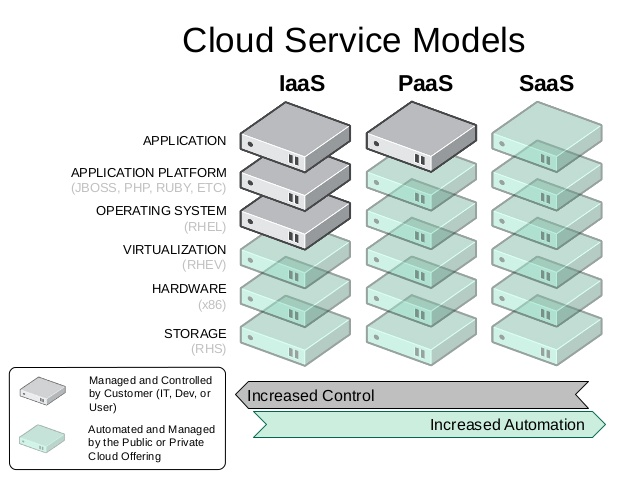

# Alerant - BME PaaS labor
# IaaS, PaaS, SaaS

## IaaS = Infrastructure as a Service
Tipikusan HW(+OS) platformot biztosít a használói számára (pl. szükségem van egy 2 CPU-s, CentOS7-re 2G memóriával)

- **Scope:** Infrastruktúra (virtuális gépek és image-ek, storage, hálózati elemek)
- **Előnyök:** erős host gépeken egységes/standard virtualizáció; rapid gépigénylés és létrehozás (akár runtime skálázással)
- **Célcsoport:** üzemeltetők, DevOps
- **Példák:** Amazon EC2, Rackspace, Google Compute Engine, OpenStack. Ennél a labornál az IaaS megoldást az OpenStack nyújtja!

BME IaaS dashboard: https://ossrv1.aut.bme.hu/horizon

## PaaS = Platform as a Service
Tipikusan alkalmazásszervereket, middleware-ket, alkalmazás futtatókörnyezetet biztosít a használói számára (pl. szükségem van egy JBoss JEE szerverre, vagy egy NodeJs futtató környezetre)

- **Scope:** Alkalmazás futtató környezetek (middleware-ek, alkalmazás platformok)
- **Előnyök:** egységes/standard alkalmazás fejlesztés és telepítési környezet; rapid platform igénylés és létrehozás (akár runtime skálázással)
- **Célcsoport:** alkalmazásfejlesztők
- **Példák:** OpenShift, Heroku, Google App Engine. Ennél a labornál a PaaS megoldást az OpenShift nyújtja!

BME PaaS dashboard: https://bmepaas-master.openshift.local:8443

## SaaS = Software as a Service
Tipikusan kész alkalmazások, azok szolgáltatásait biztosítja a használói számára (pl. szükségem van egy levelező rendszerre, CRM alkalmazásra, Webshopra stb.)

- **Scope:** Alkalmazások, szolgáltatások
- **Előnyök:** azonnal elérhető, használható szolgáltatásom van; nincsenek fejlesztési költségek; egyszeri beruházsá helyett rendszeres díjazás
- **Célcsoport:** végfelhasználók
- **Példák:** Office Cloud, Google Apps (Forms, Calendar, ...)

