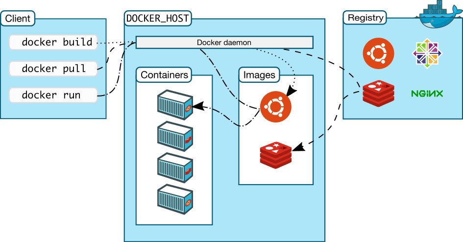

# Docker
## Konténerek
- LXC, BSD Jails, Docker
- Linux kernel technológiákra épülő izolált környezet (lightwight VM ~ nincs Hypervisor réteg)
- Izolált névterek (fs, net, ps, mount, ipc,...)
- Kiforrott, gyors, biztonságos, optimális erőforrás használat


## Alapfogalmak
- Docker image: A root fájlrendszer módosításainak rendezett és rétegelt gyűjteménye. Nem módosítható. A futó konténerek alapja, tartalmaz minden információt, hogy egy konténer példányosítható legyen belőle.
- Docker container: Egy image futásidejű példánya, egy izolált linux konténer. Alapja egy Docker image, ami kiegészül futásidejű paraméterekkel, konfigurációkkal.
- Docker registry: Image-ek gyűjtőhelye
- Dockerfile: Parancsok, utasítások gyűjteménye. Egy alap image-en futtatva sorrendhelyesen az előbbi utasításokat egy új testreszabott image áll elő.  

https://docs.docker.com/engine/reference/glossary


## Docker architektúra



## Rétegek
- Az image-en végzett utasítások újabb és újabb rétegeket képeznek.
- Egy image nem módosítható, a konténer példány is egy újabb rétegként jelenik meg.
- A konténer példány tartosítható, image-be menthető.


## Perzisztens tárolók
- A docker containerek nem perzisztensek, tehát leállítások esetén a tárolt adatok elvesznek
- Perzisztens tár becsatolható a konténerekbe


## Hálózat
- A konténerek hálózatot tekintve is izoláltak (net namespace).
- Egy konténer jellemzően egy hoston futtatott Linux Bridge-hez kapcsolódik.
- A konténer explicit kinyithatja a hálózati portjait (port forward).
- A konténerek összeköthetőek egymással.

## Legfontosabb parancsok
```shell
docker help       --parancsok leírása
docker pull       --image letöltése
docker search     --image-ek keresése
docker run        --konténer példány indítása
docker run -v     --perzisztens köteg becsatolása
docker run -it    --interaktív terminál nyitása
docker run -d     --a konténer háttérfolyamatként futni fog
docker run -p     --port forward
docker ps|top     --futó konténerek
docker inspect    --konténer futás idejű paramétereinek a lekérdezése
docker start|stop --konténer indítása, leállítása
```
